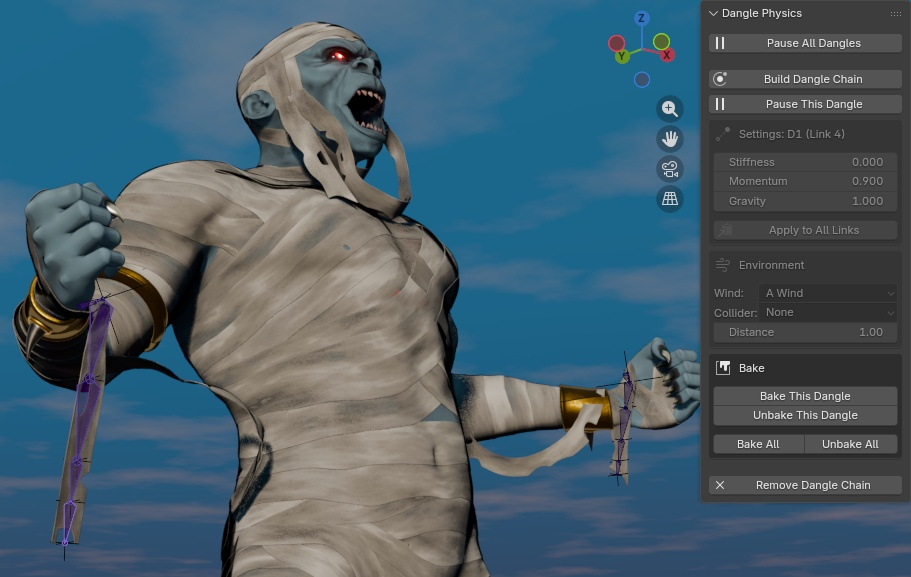
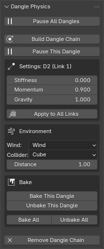
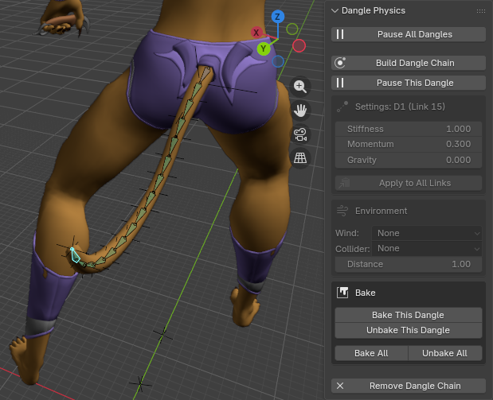
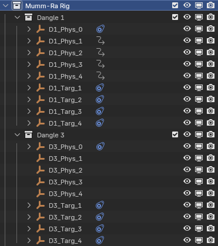

# DANGLE PHYSICS v5.1
**Lead Developer:** Paul D. Richardson  
**Collaborator:** Gemini  
**Compatibility:** Blender 5.1+

Dangle Physics is a secondary-motion engine for Blender. It automates the "swish and sway" of tails, hair, and cloth, allowing you to focus on the core performance of your characters.

---

## 1. GETTING STARTED
1. In **Pose Mode**, select your bones in order from the Base (root) to the Tip.
2. Click **"Build Dangle Chain"** in the Dangle tab (Sidebar).
3. The script creates Empties that your bones automatically track to create motion.

## 2. THE "FIRST LINK" STRATEGY
The first bone in your selection is **NOT** affected by physics. This acts as your **Manual Override**. By keyframing this first link, you "drive" the physics (e.g., swishing a tail). The rest of the chain reacts naturally to the momentum you create.

## 3. SETTINGS & RECIPES

* **Stiffness:** How hard the bone tries to return to its original pose.
* **Momentum:** The internal resistance of the chain.
* **Gravity:** Simulates downward pull.

### Recommended Recipes:
* **Heavy Chain:** Stiffness 0.2, Momentum 0.9, Gravity 1.2.
* **Organic Tail:** Stiffness 1.0, Momentum 0.8, Gravity 0.0.
* **The Whip Effect:** Set the tip Momentum to **0.3** and increase it (0.4, 0.5...) toward the base for a natural "wag fade."

## 4. ENVIRONMENT & COLLISIONS
* **Wind:** Select a native Blender Wind Force Field. The physics responds to Strength and Noise.
* **Mesh Colliders:** Select any Mesh object to act as a barrier.
* **Distance:** Adjust the "cushion" padding around your collider.

## 5. BAKING & CLEANUP

* **Baking:** Commits motion to keyframes for full-speed viewport playback.
* **Remove Dangle Chain:** Completely dismantles the system and cleans up all collections and constraints.

---
**Credits:** Special thanks to the creator of *Wiggle 2*. This tool was built as a modern successor to keep that classic secondary-motion workflow alive in Blender 5.1+.
